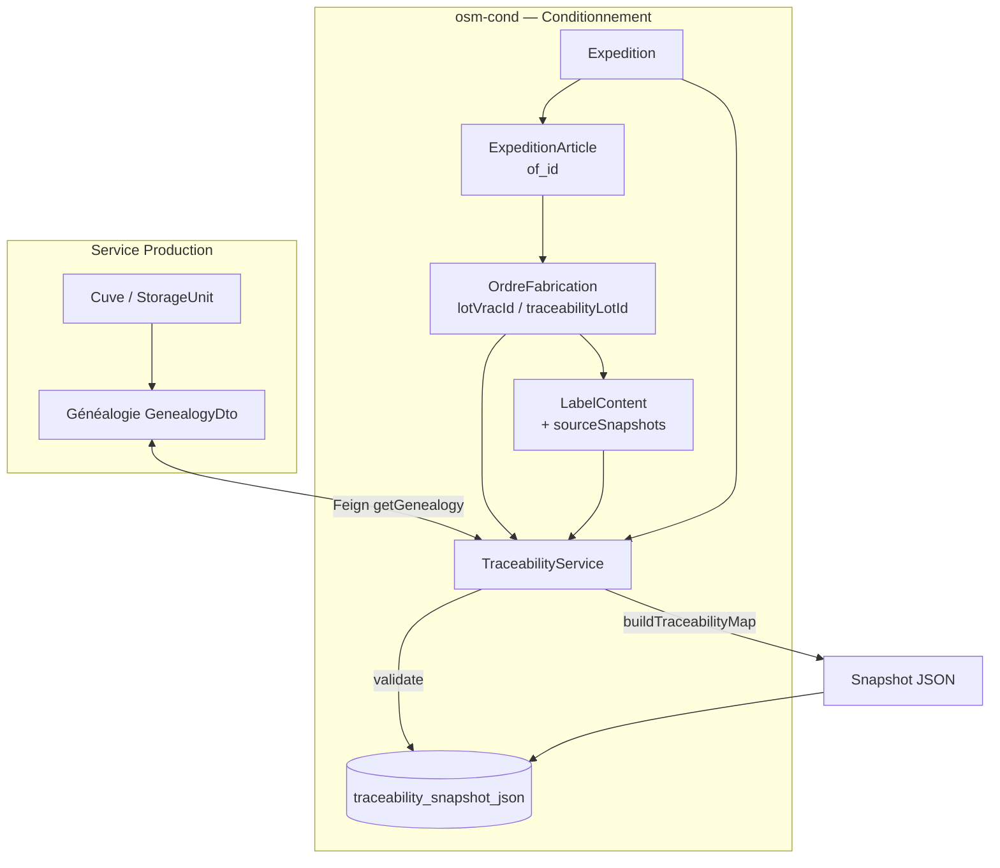

# Traçabilité — Service de conditionnement (osm-cond)

Ce document décrit **pas à pas** le fonctionnement de la traçabilité dans le microservice **osm-cond** (conditionnement) : entités impliquées, connexions inter-services, construction du snapshot JSON, validation à l'expédition et lecture via l'API.

---

## Table des matières

1. [Objectif](#1-objectif)
2. [Vue d'ensemble](#2-vue-densemble)
3. [Entités et liens](#3-entités-et-liens)
4. [Services et classes clés](#4-services-et-classes-clés)
5. [Étape par étape — du lot vrac à l'expédition](#5-étape-par-étape--du-lot-vrac-à-lexpédition)
6. [Construction du snapshot JSON](#6-construction-du-snapshot-json)
7. [Chaînes d'événements (event chains)](#7-chaînes-dévénements-event-chains)
8. [Validation et gel du snapshot](#8-validation-et-gel-du-snapshot)
9. [Lecture : live vs gelé](#9-lecture--live-vs-gelé)
10. [API REST](#10-api-rest)
11. [Règles de complétude](#11-règles-de-complétude)
12. [Workflow expédition et traçabilité](#12-workflow-expédition-et-traçabilité)
13. [Schéma de flux](#13-schéma-de-flux)
14. [Glossaire des termes techniques](#14-glossaire-des-termes-techniques)

---

## 1. Objectif

La traçabilité permet de répondre, pour chaque ligne d'une expédition :

> *D'où vient l'huile ? Comment a-t-elle été filtrée et stockée ? Quel ordre de fabrication (OF) l'a conditionnée ? Quelles étiquettes ont été posées ? Quand l'expédition a-t-elle été validée et expédiée ?*

Le point de **gel audit** est la **validation de l'expédition** (`VALIDATED`) : à ce moment, un snapshot JSON complet est sérialisé et persisté en base. Avant validation, la traçabilité est **live** (recalculée à chaque lecture).

---

## 2. Vue d'ensemble

```
┌─────────────────────┐     Feign      ┌──────────────────────────┐
│  Service Production │ ◄───────────── │  osm-cond (conditionnement) │
│  (oilproduction)    │   genealogy    │  TraceabilityService        │
└─────────────────────┘                └─────────────┬──────────────┘
        ▲                                            │
        │ lot vrac / traceabilityLotId               │ OF, Labels, Expéditions
        │                                            ▼
┌─────────────────────┐                    ┌──────────────────────────┐
│  Cuves, filtrations │                    │  PostgreSQL (osm-cond)    │
│  réceptions, QC     │                    │  expedition.traceability_   │
└─────────────────────┘                    │  snapshot_json (TEXT)       │
                                           └──────────────────────────┘
```

| Mode | Quand | Comportement |
|------|-------|--------------|
| **Live (projet)** | Avant validation, ou endpoint projet | Recalcul complet à chaque appel |
| **Live (expédition)** | Expédition sans snapshot | Idem, scope = OF des lignes |
| **Gelé (expédition)** | Après `VALIDATED` | Genealogie + étiquettes lues depuis le JSON ; chaînes d'événements recalculées à la volée |

---

## 3. Entités et liens

### 3.1 Projet (`Projet`)

- Regroupe les OF et les expéditions d'un client / commande.
- La traçabilité **projet** inclut **tous les OF** du projet (non supprimés).
- La traçabilité **expédition** ne couvre que les OF référencés sur les **lignes** de cette expédition.

### 3.2 Ordre de fabrication (`OrdreFabrication`)

Table : `ordre_fabrication`

| Champ | Rôle dans la traçabilité |
|-------|--------------------------|
| `lot_vrac_id` | ID de la cuve d'huile vrac sélectionnée pour l'OF (ancre initiale) |
| `traceability_lot_id` | ID canonique du lot de traçabilité (issu de la généalogie production) |
| `projet_id` | Lien vers le projet |
| `code`, `statut`, `quantite_cible`, `quantite_bonne` | Métadonnées dans le snapshot et la chaîne d'événements |
| `date_debut_reelle`, `date_fin_reelle` | Événements `OF_START` / `OF_END` |

**Règle d'ancrage** : pour appeler la généalogie production, on utilise en priorité `traceability_lot_id`, sinon `lot_vrac_id`.

```
Projet ──< OrdreFabrication
              │
              ├── lotVracId ──────────► Cuve (service production)
              └── traceabilityLotId ──► Lot de traçabilité (généalogie)
```

### 3.3 Étiquette (`LabelContent`)

Table : `label_content`

| Champ | Rôle |
|-------|------|
| `lot_id` | Lot lié (souvent la cuve / lot vrac) |
| `traceability_lot_id` | Lot de traçabilité canonique (aligné sur l'OF) |
| `lot_number`, `packaging_date`, `net_quantity`, etc. | Données étiquette dans le snapshot |
| `source_snapshots` (`LabelSource`) | Copies figées des sources amont (réception, filtration, etc.) |

Les étiquettes sont chargées par `traceability_lot_id`, puis en secours par `lot_id`.

### 3.4 Expédition (`Expedition`)

Table : `expedition`

| Champ | Rôle |
|-------|------|
| `projet_id` | Projet parent |
| `status` | Workflow (voir §12) |
| `traceability_snapshot_json` | **Snapshot JSON gelé** à la validation (colonne `TEXT`) |
| `validated_at`, `shipped_at`, `delivered_at` | Horodatages dans les événements expédition |

### 3.5 Ligne d'expédition (`ExpeditionArticle`)

Table : `expedition_line`

| Champ | Rôle |
|-------|------|
| `expedition_id` | Expédition parente |
| `of_id` | **Lien traçabilité** vers l'ordre de fabrication |
| `article_id`, `quantity`, `lot_number` | Détail commercial / logistique |

```
Expedition ──< ExpeditionArticle (of_id) ──► OrdreFabrication
     │
     └── traceability_snapshot_json (gel à VALIDATED)
```

### 3.6 Service externe — Production

Le conditionnement **ne stocke pas** la généalogie huile. Il la récupère via Feign :

- **Client** : `clientProductionStorage`
- **Endpoint** : `GET /api/production/traceability/genealogy/{id}`
- **DTO** : `GenealogyDto` (filtrations, chaîne d'apports, sources racines, cuve, contrôles qualité)

---

## 4. Services et classes clés

| Classe | Package | Rôle |
|--------|---------|------|
| `TraceabilityService` | `expedition.service` | Orchestrateur : snapshot, validation, live/gelé |
| `TraceabilityEventTreeBuilder` | `expedition.service` | Construit les chaînes chronologiques d'événements |
| `ExpeditionService` | `expedition.service` | Workflow expédition ; appelle la traçabilité à `validate()` |
| `ExpeditionController` | `expedition.controller` | Expose les endpoints REST |
| `OFService` | `service` | Résout `traceabilityLotId` à partir de `lotVracId` à la création/màj OF |
| `clientProductionStorage` | `client` | Feign → service production |
| `clientInventaire` | `client` | Feign → inventaire (nom produit final pour le snapshot) |

---

## 5. Étape par étape — du lot vrac à l'expédition

### Étape 1 — Création de l'OF avec un lot vrac

1. L'utilisateur crée un OF et sélectionne une **cuve** (`lot_vrac_id`).
2. `OFService` appelle le service production :
   - `getStorageUnit(lotVracId)` — vérifie que la cuve existe ;
   - `getGenealogy(lotVracId)` — récupère la généalogie.
3. Si la généalogie contient un `traceabilityLotId`, il est **persisté** sur l'OF (`traceability_lot_id`).
4. Sinon, l'ancre reste `lot_vrac_id`.

**Fichiers** : `OFService.resolveTraceabilityLotId()`, `OFService.ensureTraceabilityLotId()`

### Étape 2 — Production et étiquetage

1. L'OF passe par les statuts de production (`PLANIFIE` → démarrage → clôture).
2. Des enregistrements `LabelContent` sont créés, liés à `lot_id` et/ou `traceability_lot_id`.
3. Chaque étiquette peut porter des **`LabelSource`** (`sourceSnapshots`) : instantanés JSON des entités amont.

Lors de la construction du snapshot, `TraceabilityService` :
- charge les étiquettes par `traceability_lot_id`, puis par `lot_id` si vide ;
- rétro-remplit `traceability_lot_id` sur l'étiquette si manquant (via généalogie).

### Étape 3 — Création de l'expédition (DRAFT)

1. Une `Expedition` est créée pour un `Projet`.
2. Des lignes `ExpeditionArticle` sont ajoutées avec un **`of_id`** obligatoire pour la traçabilité.
3. Seuls les OF **du même projet** que l'expédition sont pris en compte.

**Statut** : `DRAFT` — pas encore de contrôle de traçabilité complet.

### Étape 4 — Passage en READY

Actions dans `ExpeditionService.markReady()` :

1. Vérifier qu'il y a au moins une ligne.
2. Vérifier que les produits du projet ont des **étiquettes finales**.
3. Vérifier le **stock** disponible pour les articles des lignes.

**Statut** : `READY` — stock et étiquettes OK, traçabilité pas encore gelée.

### Étape 5 — Validation (VALIDATED) — point clé

Actions dans `ExpeditionService.validate()` :

1. **`assertTraceabilityComplete(expedition)`** — contrôle que chaque OF des lignes a une origine huile documentée (voir §11).
2. Vérification des étiquettes finales (rappel).
3. Passage au statut `VALIDATED` + `validated_at`.
4. **`captureTraceabilitySnapshot(expedition)`** — sérialisation JSON → `traceability_snapshot_json`.
5. Sauvegarde en base.

**À partir de ce moment, le snapshot est irréversible** pour cette expédition (la colonne TEXT contient l'état figé au moment de la validation).

### Étape 6 — Expédition physique

- `SHIPPED` → `shipped_at`
- `DELIVERED` → `delivered_at`
- `CLOSED` → clôture administrative

Les statuts post-validation apparaissent dans les **chaînes d'événements** recalculées à la lecture, mais la généalogie et les étiquettes restent celles du snapshot gelé.

---

## 6. Construction du snapshot JSON

Méthode centrale : `TraceabilityService.buildTraceabilityMap(projectId, ofs, expedition)`.

### 6.1 Pour chaque OF du scope

| Action | Résultat dans le JSON |
|--------|------------------------|
| `ensureTraceabilityLotId(of)` | Met à jour l'OF en base si besoin |
| Snapshot métier OF | Clé dans `ofDetails` (id OF → objet) |
| `getGenealogy(ancre)` | Entrée dans `oilGenealogy` (clé = UUID ancre) |
| `labelSnapshotsForLot(of)` | Liste dans `packagedLabelsByLot` (clé = UUID ancre) |

**Ancre** : `traceabilityLotId ?? lotVracId`

### 6.2 Structure du JSON produit

```json
{
  "projectId": "uuid-du-projet",
  "expedition": {
    "id": "...",
    "expeditionNumber": "...",
    "destination": "...",
    "carrierName": "...",
    "..."
  },
  "ofDetails": {
    "uuid-of-1": {
      "code": "OF-...",
      "productId": "...",
      "articleName": "...",
      "lotVracId": "...",
      "traceabilityLotId": "...",
      "status": "TERMINE",
      "qualityStatus": "FREE",
      "quantityTarget": 1000,
      "quantityGood": 980
    }
  },
  "oilGenealogy": {
    "uuid-ancre": { "... GenealogyDto ..." }
  },
  "packagedLabelsByLot": {
    "uuid-ancre": [
      {
        "id": "...",
        "publicCode": "...",
        "lotNumber": "...",
        "packagingDate": "...",
        "sourceSnapshots": [ "..." ]
      }
    ]
  },
  "eventChains": [ "... voir §7 ..." ],
  "capturedAt": "2026-06-10T14:30:00",
  "live": true
}
```

### 6.3 Persistance du snapshot

Méthode : `TraceabilityService.captureTraceabilitySnapshot(expedition)`

1. Résout les OF des lignes (`resolveExpeditionOfs`).
2. Appelle `buildTraceabilityMap`.
3. Sérialise avec `ObjectMapper.writeValueAsString(snapshot)`.
4. Affecte la chaîne à `expedition.setTraceabilitySnapshotJson(json)`.
5. L'appelant (`ExpeditionService.validate`) fait `expeditionRepository.save(expedition)`.

**Colonne SQL** : `expedition.traceability_snapshot_json` (type `TEXT`).

---

## 7. Chaînes d'événements (event chains)

Classe : `TraceabilityEventTreeBuilder.buildChains()`.

Une **chaîne par OF** du scope, contenant une liste **`events`** ordonnée chronologiquement.

### 7.1 Phases et types d'événements

| Phase | Types d'événements | Source des données |
|-------|-------------------|-------------------|
| **PRODUCTION** | `OLIVE_RECEPTION`, `OIL_RECEPTION`, `TRITURATION`, `STORAGE_INTAKE`, `FILTRATION`, `STORAGE` | `GenealogyDto` |
| **QUALITY** | `*_QC`, `FILTRATION_QC`, `FILTERED_QC` | Contrôles qualité dans la généalogie |
| **CONDITIONING** | `OF`, `OF_START`, `OF_END`, `LABEL` | `OrdreFabrication`, `LabelContent` |
| **EXPEDITION** | `EXPEDITION` | `Expedition` liées à l'OF via les lignes |

### 7.2 Ordre de construction (logique métier)

1. Apports amont (réception olive/huile, entrée cuve source) — depuis la filtration la plus ancienne ou `intakeChain`.
2. Sources racines (`rootSources`) + QC réception.
3. Filtrations successives + QC filtration.
4. Apports restants sur le lot final.
5. Cuve finale (`STORAGE`).
6. QC lot filtré.
7. Création OF → démarrage / fin OF → étiquettes (triées par date).
8. Expéditions contenant cet OF (triées par date de validation / expédition).

Chaque événement possède : `id`, `parentId`, `type`, `phase`, `title`, `timestamp`, `details`, `sequence`.

### 7.3 Complétude origine huile

`hasDocumentedOilOrigin(genealogy)` retourne `true` si :

- `rootReceptionId` est renseigné, **ou**
- `rootSources` non vide, **ou**
- la chaîne d'apports contient un type : `OIL_RECEPTION`, `OLIVE_RECEPTION`, `RECEPTION`, `TRITURATION` (y compris dans `sourceIntakeChain` des filtrations).

Utilisé par **`assertTraceabilityComplete`** avant validation.

---

## 8. Validation et gel du snapshot

### 8.1 Contrôle pré-validation

`TraceabilityService.assertTraceabilityComplete(expedition)` :

1. Récupère les OF des lignes (même projet).
2. Si aucun OF → erreur.
3. Pour chaque OF :
   - Vérifie présence de `lot_vrac_id` ou `traceability_lot_id`.
   - Appelle `getGenealogy(ancre)`.
   - Vérifie `hasDocumentedOilOrigin(genealogy)`.
4. Agrège les problèmes → `IllegalStateException` avec message `Tracabilite incomplete : ...`.

### 8.2 Capture

Si le contrôle passe, `captureTraceabilitySnapshot` :

- Reconstruit le map complet ;
- Écrit le JSON dans `traceability_snapshot_json` ;
- Le flag `live` dans le JSON est `false` une fois relu depuis le snapshot (voir §9).

**Important** : après `VALIDATED`, les lignes et champs sensibles de l'expédition ne sont plus modifiables (`ensureEditable` bloque les changements).

---

## 9. Lecture : live vs gelé

### 9.1 Traçabilité projet (toujours live)

Endpoint : `GET /api/expeditions/project/{projectId}/traceability`

→ `TraceabilityService.getLiveProjectTraceability(projectId)`

- Charge **tous** les OF du projet.
- Reconstruit le snapshot à chaque appel.
- `live: true`.

### 9.2 Traçabilité expédition

Endpoint : `GET /api/expeditions/{id}/traceability`

→ `TraceabilityService.getExpeditionTraceability(expedition)`

**Si `traceability_snapshot_json` est renseigné** :

1. Désérialise le JSON en `Map`.
2. **`refreshRuntimeEventChains`** :
   - Relit `oilGenealogy` et `packagedLabelsByLot` depuis le snapshot (données **gelées**).
   - Recharge les expéditions du projet en base.
   - Reconstruit uniquement `eventChains`.
   - Met `live: false`.

**Sinon** (expédition non validée ou JSON invalide) :

- Reconstruction live via `buildTraceabilityMap`.
- `live: true`.

| Donnée | Snapshot gelé | Recalcul live à la lecture |
|--------|---------------|----------------------------|
| Généalogie huile | Oui | Non (si snapshot présent) |
| Étiquettes | Oui | Non (si snapshot présent) |
| Détails OF dans snapshot | Oui | Non (si snapshot présent) |
| Chaînes d'événements | Non | Oui (toujours recalculées) |

---

## 10. API REST

| Méthode | URL | Description |
|---------|-----|-------------|
| `GET` | `/api/expeditions/project/{projectId}/traceability` | Traçabilité live de **tout le projet** |
| `GET` | `/api/expeditions/{id}/traceability` | Traçabilité de **l'expédition** (gelée si validée) |
| `POST` | `/api/expeditions/{id}/validate` | Valide l'expédition + capture snapshot |

Réponse : `Map<String, Object>` (structure décrite au §6.2).

---

## 11. Règles de complétude

Pour qu'une expédition passe en `VALIDATED`, **chaque OF** référencé sur une ligne doit :

| # | Règle | Message d'erreur typique |
|---|-------|-------------------------|
| 1 | Avoir un lot vrac ou lot de traçabilité | `aucun lot vrac ou lot de tracabilite` |
| 2 | Avoir une généalogie production accessible | `genealogie huile introuvable` |
| 3 | Avoir une origine documentée | `origine reception ou trituration manquante` |

En parallèle (hors `TraceabilityService` mais même transition `validate`) :

- Étiquettes finales présentes sur les produits du projet ;
- Expédition en statut `READY` avant validation.

---

## 12. Workflow expédition et traçabilité

```
DRAFT ──► READY ──► VALIDATED ──► SHIPPED ──► DELIVERED ──► CLOSED
  │         │            │
  │         │            └── Snapshot JSON capturé (traceability_snapshot_json)
  │         └── Stock + étiquettes finales
  └── Lignes avec of_id
```

| Transition | Impact traçabilité |
|------------|-------------------|
| `DRAFT` | Consultation live possible ; pas de gel |
| `READY` | Prérequis logistique ; traçabilité toujours live |
| **`VALIDATED`** | **`assertTraceabilityComplete` + `captureTraceabilitySnapshot`** |
| `SHIPPED` / `DELIVERED` | Horodatages reflétés dans `eventChains` |
| `CANCELLED` | Pas de snapshot si annulée avant validation |

---

## 13. Schéma de flux



---

## 14. Glossaire des termes techniques

Ce glossaire explique **chaque mot ou acronyme technique** utilisé dans ce document, du vocabulaire métier (huile, olive) au vocabulaire logiciel (Feign, JSON, snapshot).

### 14.1 Concepts généraux

| Terme | Explication |
|-------|-------------|
| **Traçabilité** | Capacité à retracer l'historique d'un produit : matières premières, transformations, conditionnement et expédition. Ici, c'est un **document JSON structuré** plus une **timeline d'événements**. |
| **Gel audit / point de gel** | Moment où les données de traçabilité sont **figées** et ne doivent plus changer. Dans osm-cond, c'est la **validation de l'expédition** (`VALIDATED`). |
| **Live (en direct)** | Mode où la traçabilité est **recalculée à chaque lecture** à partir des données actuelles (base + APIs). Le flag JSON `live: true` indique ce mode. |
| **Gelé / snapshot gelé** | Mode où la généalogie huile et les étiquettes sont lues depuis le **JSON enregistré** à la validation. Le flag `live: false` indique ce mode. |
| **Snapshot** | Instantané (copie à un instant T) de l'état de la traçabilité, sérialisé en **JSON** et stocké en base. |
| **Scope (périmètre)** | Ensemble d'OF pris en compte : **tous les OF du projet** (endpoint projet) ou **uniquement les OF des lignes d'une expédition** (endpoint expédition). |
| **Ancre (genealogy anchor)** | Identifiant UUID utilisé pour interroger la généalogie production. Priorité : `traceability_lot_id`, sinon `lot_vrac_id`. |
| **Origine documentée** | Preuve que l'huile a une filière connue (réception olive/huile ou trituration). Contrôlé par `hasDocumentedOilOrigin`. |
| **Complétude (traçabilité)** | Toutes les règles remplies pour autoriser la validation : lot présent, généalogie accessible, origine documentée. |

### 14.2 Métier — production et huile

| Terme | Explication |
|-------|-------------|
| **Lot vrac** | Huile en **vrac** (non conditionnée), stockée en cuve. En base : `lot_vrac_id` sur l'OF = ID de la cuve sélectionnée. |
| **Cuve / StorageUnit** | Contenant de stockage d'huile en production (ex. cuve inox). Entité du **service production**, récupérée via `getStorageUnit`. |
| **Lot de traçabilité** | Identifiant **canonique** du lot dans la chaîne de traçabilité production (peut différer de l'ID cuve après filtrations). Champ : `traceability_lot_id`. |
| **Généalogie (GenealogyDto)** | Arbre / historique complet d'un lot d'huile : réceptions, triturations, filtrations, apports en cuve, contrôles qualité. Fourni par le **service production**. |
| **Réception olive (`OLIVE_RECEPTION`)** | Entrée de **olives** en usine (fournisseur, numéro de lot olive). Étape amont de la filière « olive → huile ». |
| **Réception huile (`OIL_RECEPTION`)** | Entrée d'**huile déjà produite** ou achetée (fournisseur externe). |
| **Trituration (`TRITURATION`)** | Transformation des **olives en huile** (extraction). Étape de production interne. |
| **Filtration (`FILTRATION`)** | Passage de l'huile d'un lot/cuve source vers un lot/cuve cible pour clarifier ou transférer. Plusieurs filtrations possibles sur un même parcours. |
| **Apport / intake (`STORAGE_INTAKE`, intake chain)** | **Entrée de volume** dans une cuve (transfert, mélange, alimentation après réception). La `intakeChain` liste ces mouvements. |
| **Sources racines (`rootSources`)** | Points de départ connus de la filière (première réception, trituration, etc.) dans la généalogie. |
| **QC / Contrôle qualité** | Mesures ou validations qualité à une étape (réception, filtration, lot filtré). Apparaît comme événements `*_QC` dans la timeline. |
| **Conditionnement** | Phase où l'huile vrac est **mise en emballage** (bouteilles, bidons) sous un OF. Microservice **osm-cond**. |

### 14.3 Entités applicatives (osm-cond)

| Terme | Explication |
|-------|-------------|
| **osm-cond** | Microservice **conditionnement** : OF, étiquettes, projets, expéditions, traçabilité. |
| **Projet (`Projet`)** | Commande ou dossier client regroupant plusieurs OF et expéditions. |
| **OF / Ordre de fabrication (`OrdreFabrication`)** | Ordre de production en conditionnement : produit à fabriquer, quantités, cuve vrac utilisée, lien projet. |
| **Étiquette / Label (`LabelContent`)** | Contenu réglementaire et marketing d'une étiquette posée sur un emballage (lot, DLC, quantité, QR, etc.). |
| **LabelSource (`sourceSnapshots`)** | Sous-enregistrement lié à une étiquette : **copie figée** (JSON) d'une entité amont (réception, filtration…) au moment de la finalisation de l'étiquette. |
| **Expédition (`Expedition`)** | Envoi physique de produits finis vers un client ; contient transport, statuts workflow et **snapshot de traçabilité**. |
| **Ligne d'expédition (`ExpeditionArticle`)** | Une ligne de produit dans une expédition : article, quantité, et surtout **`of_id`** pour lier la traçabilité à un OF. |
| **Produit final** | Article fini conditionné (SKU). Nom récupéré via le service **inventaire** pour le snapshot. |

### 14.4 Champs de base de données importants

| Terme | Explication |
|-------|-------------|
| **`lot_vrac_id`** | Colonne UUID : cuve d'huile vrac choisie pour l'OF ou lot lié à l'étiquette. |
| **`traceability_lot_id`** | Colonne UUID : lot de traçabilité canonique (prioritaire pour la généalogie). |
| **`traceability_snapshot_json`** | Colonne **TEXT** sur `expedition` : JSON complet du snapshot, écrit à la validation. |
| **`of_id`** | Sur une ligne d'expédition : référence vers l'ordre de fabrication tracé. |
| **`projet_id`** | Lien expédition ou OF → projet parent. |
| **`validated_at` / `shipped_at` / `delivered_at`** | Horodatages des étapes expédition ; utilisés dans les événements timeline. |
| **`capturedAt`** | Champ dans le JSON snapshot : date/heure de **capture** du snapshot. |
| **`publicCode` / `qrHex`** | Code public (souvent QR) d'une étiquette ou entité, pour identification terrain. |

### 14.5 Structure du snapshot JSON

| Terme | Explication |
|-------|-------------|
| **JSON** | Format texte structuré (objets, listes) pour échanger et stocker des données. Ici, tout le snapshot traçabilité. |
| **`ofDetails`** | Section du snapshot : map **ID OF → détails** (code, statut, quantités, lots). |
| **`oilGenealogy`** | Section : map **UUID ancre → GenealogyDto** (généalogie huile figée ou live). |
| **`packagedLabelsByLot`** | Section : map **UUID ancre → liste d'étiquettes** conditionnées pour ce lot. |
| **`eventChains`** | Section : liste de **chaînes chronologiques**, une par OF (voir ci-dessous). |
| **`eventChains[].events`** | Liste ordonnée d'**événements** (réception, filtration, OF, étiquette, expédition…). |
| **`live`** | Booléen dans le JSON : `true` = données recalculées ; `false` = lecture depuis snapshot gelé (partiellement). |

### 14.6 Chaîne d'événements (event chain)

| Terme | Explication |
|-------|-------------|
| **Event chain / chaîne d'événements** | Timeline métier pour **un OF** : enchaînement parent/enfant d'étapes de PRODUCTION → CONDITIONING → EXPEDITION. |
| **`sequence`** | Numéro d'ordre (1, 2, 3…) assigné à chaque événement dans la chaîne. |
| **`parentId`** | ID de l'événement **précédent** dans la chaîne logique (lien arbre). |
| **`phase`** | Grand regroupement : `PRODUCTION`, `QUALITY`, `CONDITIONING`, `EXPEDITION`. |
| **`type`** | Code précis de l'événement : ex. `FILTRATION`, `OF_START`, `LABEL`, `EXPEDITION`. |
| **`OF_START` / `OF_END`** | Début et fin **réels** de la production sur l'OF (`date_debut_reelle`, `date_fin_reelle`). |
| **`LABEL`** | Événement étiquetage : une étiquette posée sur un lot conditionné. |
| **`EXPEDITION`** | Événement expédition : une expédition du projet qui référence cet OF sur une ligne. |
| **`refreshRuntimeEventChains`** | Méthode qui **recalcule uniquement** `eventChains` à partir d'un snapshot gelé + expéditions actuelles en base. |

### 14.7 Statuts expédition (`ExpeditionStatus`)

| Statut | Explication |
|--------|-------------|
| **`DRAFT`** | Brouillon : expédition créée, lignes modifiables, pas de snapshot. |
| **`READY`** | Prête logistiquement : lignes OK, stock et étiquettes finales vérifiés ; traçabilité encore live. |
| **`VALIDATED`** | Validée administrativement : contrôle traçabilité OK, **snapshot capturé**, modification bloquée. |
| **`SHIPPED`** | Expédiée : marchandise partie (`shipped_at`). |
| **`DELIVERED`** | Livrée chez le client (`delivered_at`). |
| **`CLOSED`** | Clôturée : dossier expédition terminé. |
| **`CANCELLED`** | Annulée (avant ou après certaines étapes ; pas de snapshot si annulée avant validation). |

### 14.8 Statuts OF (`StatutOF`) — rappel

| Statut | Explication |
|--------|-------------|
| **`PLANIFIE`** | OF créé, pas encore démarré en production. |
| **Démarrage / clôture** | Les dates réelles alimentent `OF_START` et `OF_END` dans la traçabilité (ex. statuts `EN_COURS`, `TERMINE` selon implémentation). |

### 14.9 Architecture et intégration

| Terme | Explication |
|-------|-------------|
| **Microservice** | Application backend autonome avec sa base et son API (ex. osm-cond, production, inventaire). |
| **Service production (oilproduction)** | Microservice amont : cuves, filtrations, réceptions, généalogie huile. |
| **Service inventaire (osm-pack)** | Microservice stock et articles : produits finaux, stock disponible. |
| **Feign** | Bibliothèque **Spring Cloud** pour appeler un autre microservice via une **interface Java** déclarative (client HTTP). |
| **`clientProductionStorage`** | Client Feign osm-cond → production (`getStorageUnit`, `getGenealogy`). |
| **`clientInventaire`** | Client Feign osm-cond → inventaire (ex. nom du produit final). |
| **API REST** | Interface HTTP (GET, POST…) exposée par le backend. Ex. `/api/expeditions/.../traceability`. |
| **Endpoint** | URL précise d'une API (méthode + chemin). |
| **DTO (Data Transfer Object)** | Objet Java de **transfert** entre services ou vers le frontend (ex. `GenealogyDto`, `ExpeditionDto`). |
| **Entity / Entité JPA** | Classe Java mappée à une **table SQL** (ex. `Expedition` → table `expedition`). |
| **Repository** | Couche d'accès base de données (Spring Data JPA) : `ofRepository`, `expeditionRepository`, etc. |
| **ObjectMapper** | Composant **Jackson** : convertit objets Java ↔ JSON (sérialisation du snapshot). |
| **UUID** | Identifiant unique universel (format `xxxxxxxx-xxxx-xxxx-xxxx-xxxxxxxxxxxx`) pour clés primaires et liens. |
| **PostgreSQL** | SGBD relationnel utilisé pour persister les entités osm-cond. |
| **TEXT (SQL)** | Type de colonne permettant de stocker de longues chaînes (ici le JSON snapshot). |
| **Sérialisation** | Transformation d'un objet en format stockable/transmissible (ici : objet Map → chaîne JSON). |
| **Désérialisation** | Opération inverse : lire le JSON snapshot et reconstruire une structure en mémoire. |
| **Transactional (`@Transactional`)** | Annotation Spring : regroupe les opérations base en une **transaction** (cohérence lecture/écriture). |
| **`IllegalStateException`** | Exception Java levée quand une **règle métier** est violée (ex. traçabilité incomplète à la validation). |

### 14.10 Classes et méthodes clés (code)

| Terme | Explication |
|-------|-------------|
| **`TraceabilityService`** | Service central : construit snapshots, valide complétude, gère live vs gelé. |
| **`TraceabilityEventTreeBuilder`** | Utilitaire qui **assemble la timeline** `eventChains` à partir généalogie + OF + étiquettes + expéditions. |
| **`ExpeditionService`** | Service métier expédition : workflow DRAFT→CLOSED, appelle traçabilité à `validate()`. |
| **`ExpeditionController`** | Contrôleur REST exposant les endpoints traçabilité et actions expédition. |
| **`OFService`** | Service ordres de fabrication ; résout et enregistre `traceabilityLotId` depuis le lot vrac. |
| **`buildTraceabilityMap`** | Méthode qui **assemble** toutes les sections du JSON snapshot. |
| **`captureTraceabilitySnapshot`** | Méthode qui construit le map et l'**enregistre** dans `traceability_snapshot_json`. |
| **`assertTraceabilityComplete`** | Méthode de **contrôle bloquant** avant validation : vérifie chaque OF des lignes. |
| **`getLiveProjectTraceability`** | Lecture traçabilité **projet** toujours recalculée. |
| **`getExpeditionTraceability`** | Lecture traçabilité **expédition** : snapshot gelé si présent, sinon live. |
| **`resolveExpeditionOfs`** | Résout la liste des OF à partir des **lignes** de l'expédition (même projet uniquement). |
| **`ensureTraceabilityLotId`** | Rétro-remplit `traceability_lot_id` sur OF ou étiquette si manquant (appel généalogie). |
| **`hasDocumentedOilOrigin`** | Fonction booléenne : la généalogie contient-elle une origine huile/olive valide ? |
| **`ensureEditable`** | Vérifie qu'une expédition n'est pas déjà VALIDATED+ avant modification. |
| **`markReady` / `validate` / `ship` / `deliver` / `close`** | Transitions de statut expédition dans `ExpeditionService`. |

### 14.11 Acronymes et abréviations

| Acronyme | Signification |
|----------|---------------|
| **OF** | Ordre de fabrication |
| **QC** | Quality Control — contrôle qualité |
| **API** | Application Programming Interface — interface de programmation (HTTP ici) |
| **REST** | Style d'API HTTP basé sur ressources et verbes (GET, POST, PUT…) |
| **JSON** | JavaScript Object Notation — format de données texte |
| **JPA** | Java Persistence API — standard mapping objet ↔ base relationnelle |
| **SKU** | Stock Keeping Unit — référence produit (ici `productId`) |
| **DLC / Best before** | Date limite de consommation ou date de durabilité minimale (`bestBeforeDate`) |
| **QR** | Code QR scannable (`publicCode`, `qrHex`) |
| **Feign** | Nom du client HTTP déclaratif Spring Cloud (pas un acronyme métier) |

---

## Fichiers source de référence

| Fichier | Chemin relatif (osm-cond) |
|---------|---------------------------|
| Orchestrateur traçabilité | `src/main/java/com/osm/conditioning/expedition/service/TraceabilityService.java` |
| Arbre d'événements | `src/main/java/com/osm/conditioning/expedition/service/TraceabilityEventTreeBuilder.java` |
| Workflow expédition | `src/main/java/com/osm/conditioning/expedition/service/ExpeditionService.java` |
| API REST | `src/main/java/com/osm/conditioning/expedition/controller/ExpeditionController.java` |
| Client production | `src/main/java/com/osm/conditioning/client/clientProductionStorage.java` |
| Résolution lot OF | `src/main/java/com/osm/conditioning/service/OFService.java` |
| Entité expédition | `src/main/java/com/osm/conditioning/expedition/model/Expedition.java` |

---

*Document généré pour le module osm-cond — traçabilité expédition / projet.*
